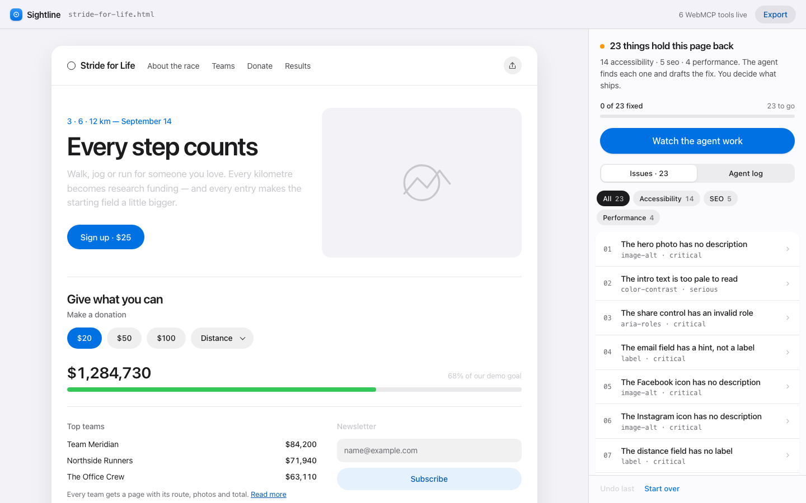
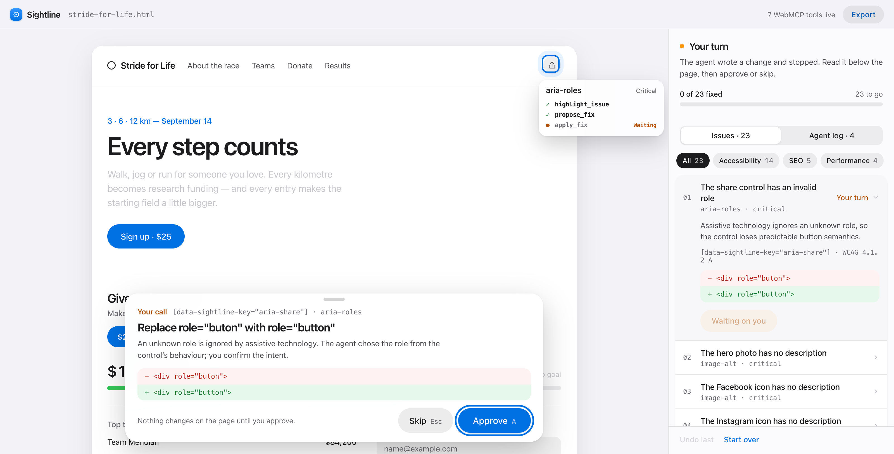

<div align="center">

# Sightline

### The approval layer between an agent and a live page.

**Sightline is a Copilot for pages. A browser agent finds what holds a page
back — accessibility, SEO, performance — and drafts the fix. Nothing ships
until a person says yes, inside the page, with the exact change in view.**

[](https://github.com/marcelsafin/sightline/actions/workflows/ci.yml)
[](LICENSE)
[](src/webmcp.ts)

[Live demo](https://sightline-5vu.pages.dev) ·
[Demo script](submission/DEMO_SCRIPT.md) ·
[Devpost copy](submission/DEVPOST.md)

</div>



## The idea

Every "AI fixes your site" tool makes the same trade: speed for control. The
agent edits somewhere you cannot see, on a copy you did not watch, and reports
back "done". Sightline refuses that trade.

Sightline is a **human-approval layer** built on WebMCP. The agent works on the
real page, in front of you, through declared tools. Every read is free. Every
forward change stops for your click; `revert_fix` only reverses changes you
already approved. Accessibility is the first rule pack; SEO and performance
run on the same engine, through the same gate.

1. `list_packs` tells the agent what this page can be checked for.
2. `scan_page` runs one or all packs and returns stable issue IDs, per-pack
   scores, and an overall score.
3. `highlight_issue` puts the exact DOM node in front of both of you.
4. `propose_fix` splits the work honestly: the **agent authors** human-facing
   content (alt text, labels, roles, page title, meta description, link text)
   and the **engine measures** what can be measured (contrast ratio from real
   luminance, heading level from the document outline, image dimensions). Ask
   for a fix without authoring and the tool answers `needs_input` with page
   context — it never invents the words.
5. `apply_fix` pauses inside the page until the person approves or skips.
6. `re_scan` proves the change. `revert_fix` undoes any approved step.
   `export_patch` ships only what a human approved.

## Three rule packs, one gate

| Pack | Checks | Who authors the fix |
|---|---|---|
| **Accessibility** (axe-core) | alt text, form labels, contrast, heading order, ARIA roles, focus order | agent for words, engine for measurements |
| **SEO** | document title, meta description, single h1, descriptive link text, `lang` | agent for words, engine for structure |
| **Performance** | image dimensions (CLS), lazy loading below the fold, `rel="noopener"` | engine — all measured |

Packs are a first-class primitive (`src/packs/types.ts`). A pack is
`{ scan(root), fixers }`; the engine, the WebMCP tool surface, undo, and export
are shared. Adding a fourth pack is one file.

## Why WebMCP

This cannot be built by pointing an agent at buttons:

| Without WebMCP | With Sightline tools |
|---|---|
| Agent scrapes a report | Agent receives typed issue IDs, selectors, per-pack scores |
| Agent and person look at different things | `highlight_issue` puts one DOM node in front of both |
| Suggested code is detached from the page | Patch carries live before/after DOM and measured evidence |
| Writes happen invisibly | `apply_fix` **blocks inside the tool call** until a human clicks |
| "Fixed" is a claim | `re_scan` measures the changed page |
| Work vanishes into chat | `export_patch` produces a reviewable diff |

Tools are registered imperatively and appear as the workflow unlocks them:
`apply_fix` after a proposal, `revert_fix`/`export_patch` after an approval.
Chrome emits native tool-change events at each step. Every callback honours
`AbortSignal`. Read tools carry `readOnlyHint`; anything returning page content
carries `untrustedContentHint`.

## Nine structured tools

| Tool | Purpose | Safety |
|---|---|---|
| `list_packs` | Discover rule packs and what each requires | Read-only |
| `scan_page` | Run selected packs; per-pack + overall score | Read-only |
| `navigate_node` | Inspect page context at a selector | Read-only; untrusted content |
| `highlight_issue` | Move the shared focus overlay | Read-only |
| `propose_fix` | Draft a scoped patch; may return `needs_input` | Read-only; untrusted content |
| `apply_fix` | Stage mutation and **wait for a human click** | Human checkpoint |
| `re_scan` | Verify score and remaining issues | Read-only |
| `revert_fix` | Rebuild the page without one approved fix | Reversible |
| `export_patch` | Export approved changes as diff/report | Read-only |

## Deterministic judging demo

The bundled Stride for Life page carries **23 real, deliberately planted
problems**: 14 accessibility, 5 SEO, 4 performance. It contains only problems —
no hidden answers for the agent to read. Scans run in an isolated 900px audit
frame so the result is identical on every viewport.

Score is transparent per pack and overall: `100 − 2 × open issues`. The page
starts at **54 overall** (72 / 90 / 92) and ends at **100 / 100 / 100** after
23 human-approved changes. Nine of those changes required the agent to write
something; fourteen were measured by the engine.



The bundled **Watch the agent work** button is itself a WebMCP client: it calls
`document.modelContext.getTools()` / `executeTool()` exactly as an external
WebMCP agent does (verified natively with Chrome 151), and stops at every
`apply_fix`.

## Run locally

Requirements: Node.js 20.19+ and Chrome 151+.

```bash
npm install
npm run dev
```

Then enable `chrome://flags/#enable-webmcp-testing`, relaunch Chrome, and open
the local URL. To inspect the page's registered tools:

```js
await document.modelContext.getTools()
```

Useful project commands:

```bash
npm run check      # lint · typecheck (app + tests) · vitest · build · bundle budget
npm test           # vitest: content validation, WCAG maths, approval state machine, constitution
npm run smoke      # drives the live site through Chrome's native WebMCP CDP domain (needs Chrome 151+, pip install websocket-client)
npm run build
npm run preview
```

`npm run smoke` is how every deploy is verified: it registers as an external
agent, checks the annotations, forces a `needs_input` round, stages
`apply_fix`, proves the DOM is untouched and the call is still pending while
the sheet is open, approves, and checks that `export_patch` appears with
`untrustedContentHint` — 15 invariants, exit code 0 or 1.

### Judging in two minutes

1. Open <https://sightline-5vu.pages.dev> in Chrome 151+ with
   `chrome://flags/#enable-webmcp-testing` enabled. Six tools register on load;
   three more appear as the workflow unlocks.
2. Ask your agent: *"List this page's rule packs, scan it, take the
   highest-impact issue, propose a fix — author any text it needs — and apply
   it. Stop when the page asks for my approval."*
3. Expect `scan_page` → 23 issues, overall 54. `propose_fix` on the first issue
   returns `needs_input` (the engine will not invent a role); the agent calls
   again with `role: "button"`. `apply_fix` stays pending until you click
   **Approve** in the *Your call* sheet, then re-scans and returns 56.
4. No agent handy? **Watch the agent work** is a real WebMCP client
   (`getTools()` / `executeTool()`) and stops at the same sheet.

## Implementation

- React + TypeScript + Vite; static deployment on Cloudflare Pages — no
  backend, account, model API or key
- one event-driven engine shared by the human UI and every WebMCP callback
- rule packs implement `AuditPack = { scan, fixers }`: accessibility (axe-core,
  six deliberate rule classes), SEO and performance (plain DOM checks)
- agent-authored content validated as plain text; engine-measured facts in
  `evidence[]`; `authoredBy` on every patch
- selector-scoped patches; arbitrary agent code is never executed
- snapshot-derived undo that can remove any approved fix safely
- Vitest (jsdom) covers content validation, WCAG contrast maths, structural
  selectors and the approval state machine — including a regression test for
  concurrent `apply_fix` calls during the post-approval re-scan; GitHub
  Actions runs lint, typecheck, tests, build, a bundle budget and a
  no-planted-answers check on every push

Core files:

- [`src/engine.ts`](src/engine.ts) — audit, proposals, consent, undo, exports
- [`src/webmcp.ts`](src/webmcp.ts) — schemas, annotations, progressive tools
- [`src/packs/`](src/packs) — `accessibility.ts`, `seo.ts`, `performance.ts`, shared helpers
- [`src/demo.ts`](src/demo.ts) — deterministic 23-problem fixture (14 accessibility · 5 SEO · 4 performance)
- [`src/__tests__/`](src/__tests__) — Vitest suites
- [`.specify/memory/constitution.md`](.specify/memory/constitution.md) — the six principles this build is held to

## Scope and honesty

Sightline demonstrates **verified pair-fixing**, not automated compliance.
Automated rules cannot replace keyboard, screen-reader, cognitive, usability,
or expert conformance testing. Exports state that boundary explicitly.

## License

[MIT](LICENSE)
